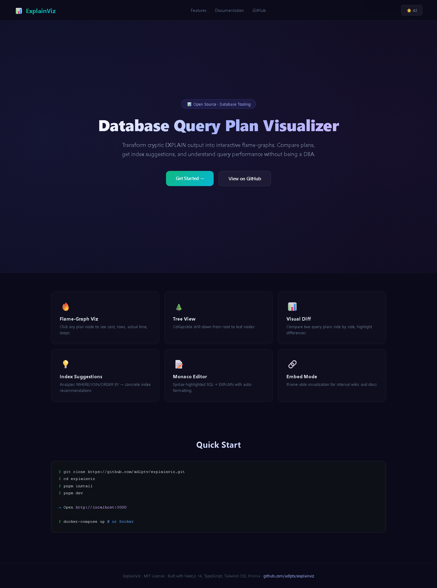
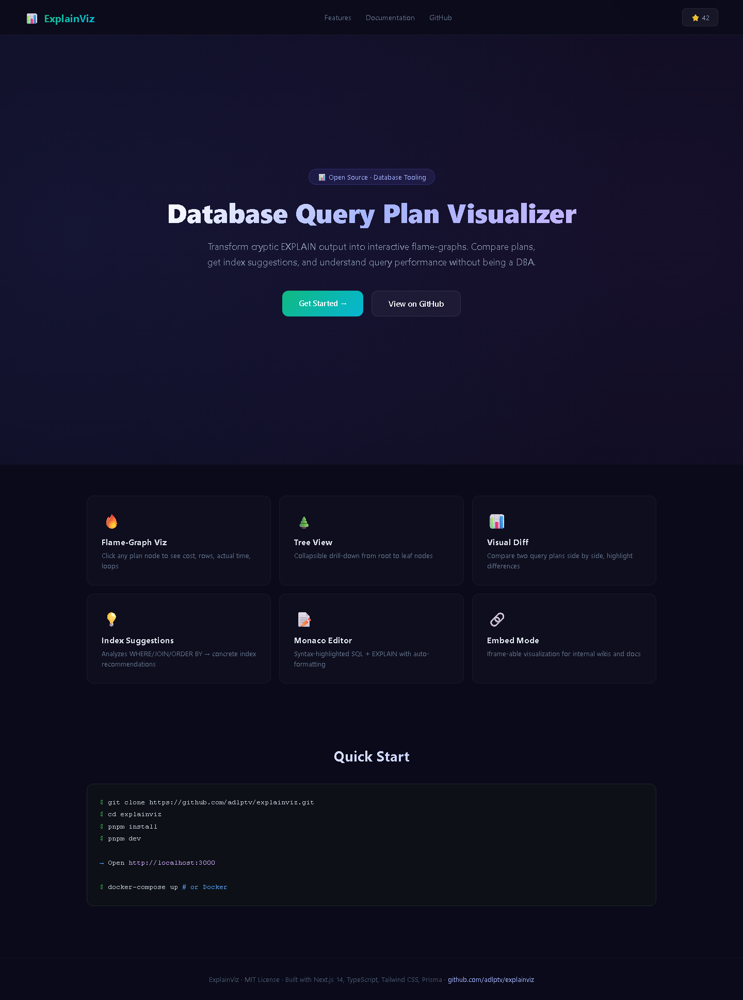

<div align="center">

# 📊 ExplainViz — Database Query Plan Visualizer

**Understand your database queries without being a DBA**

[](LICENSE)
[](https://www.typescriptlang.org/)
[](https://nextjs.org/)
</div>

## 📖 What is ExplainViz?

`EXPLAIN ANALYZE` output is cryptic. Developers often do blind optimization — add indexes without understanding the query plan. ExplainViz transforms raw EXPLAIN output from PostgreSQL, MySQL, and SQLite into **interactive visualizations** that make query performance obvious.

## ✨ Features

- 🔥 **Interactive Flame-Graph** — Click any plan node to see cost, rows, time, loops
- 🌲 **Collapsible Tree View** — Drill down from root to leaf nodes
- 📊 **Visual Diff** — Compare two query plans side by side, highlight differences
- 💡 **Index Suggestion Engine** — Analyzes WHERE/JOIN/ORDER BY → recommends specific indexes with estimated impact
- 📝 **Monaco Editor** — Syntax-highlighted SQL input + EXPLAIN output
- 🔗 **Embed Mode** — Iframe-able visualization for internal wikis
- 📚 **History** — Save and search past analyses
- 🐘 **PostgreSQL Connection** — Live EXPLAIN from your database (optional)
- 🌓 **Dark/Light Theme** — Glassmorphism UI
- 🐳 **Docker** — Multi-stage build with docker-compose

## 📸 Screenshots

| Landing Page | Dashboard |
|:---:|:---:|
|  |  |

> 💡 *Run locally to see the full interactive experience: `pnpm dev` then open http://localhost:3000*


## 🏗️ Architecture

```
┌────────────────────────────────────────────┐
│               ExplainViz                    │
├──────────────┬──────────────┬──────────────┤
│   Frontend   │   Backend    │   Parser     │
│  Next.js 14  │  API Routes  │  PostgreSQL  │
│  D3.js       │  Prisma ORM  │  MySQL       │
│  Monaco      │  SQLite      │  SQLite      │
└──────────────┴──────────────┴──────────────┘
```

## 🚀 Quick Start

```bash
git clone https://github.com/adlptv/explainviz.git
cd explainviz
pnpm install
pnpm dev
# → http://localhost:3000
```

Docker:
```bash
docker-compose up
```

## 📡 API

| Method | Endpoint | Description |
|--------|----------|-------------|
| POST | `/api/analyze` | Parse EXPLAIN → structured visualization data |
| POST | `/api/diff` | Compare two query plans |
| POST | `/api/suggest-indexes` | Generate index recommendations |
| GET | `/api/history` | List past analyses |
| GET/DELETE | `/api/history/[id]` | Get/delete analysis |
| GET | `/api/embed/[id]` | Embeddable view data |
| GET | `/api/health` | Health check |

## 📦 Supported Plan Node Types

PostgreSQL: Seq Scan, Index Scan, Index Only Scan, Bitmap Index Scan, Bitmap Heap Scan, Nested Loop, Hash Join, Merge Join, Hash, Sort, Aggregate, GroupAggregate, Limit, Append, Subquery Scan, CTE Scan, Materialize, Gather, WindowAgg, Unique, SetOp, Recursive Union, Result

MySQL & SQLite plan types also supported.

## 🔒 Security

- ✅ Zod validation all routes
- ✅ Rate limiting
- ✅ Helmet.js headers
- ✅ SQL injection prevention (no raw SQL from user input)
- ✅ Input sanitization

## 📄 License

MIT © [adlptv](https://github.com/adlptv)

---

⭐ **Star this repo** if you find it useful!
